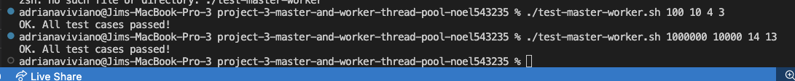

# Master-Worker

In this project, you will implement a simple master and worker thread pool, a pattern that occurs
in many real life applications. The master threads produce numbers continuously and place them in
a buffer, and worker threads will consume them, i.e., print these numbers to the screen. This simple
program is an example of a master-worker thread pool pattern that is commonly found in several reallife
application servers. For example, in the commonly used multi-threaded architecture for web servers,
the server has one or more master threads and a pool of worker threads. When a new connection arrives
from a web client, the master accepts the request and hands it over to one of the workers. The worker
then reads the web request from the network socket and writes a response back to the client. Your simple
master-worker program is similar in structure to such applications, albeit with much simpler request
processing logic at the application layer.

You are given a skeleton program master-worker-skeleton.c. This program takes 4 command
line arguments: how many numbers to “produce” (M), the maximum size of the buffer in which
the produced numbers should be stored (N), the number of worker threads to consume these numbers
(C), and the number of master threads to produce numbers (P). The skeleton code spawns P master
threads, that produce the specified number of integers from 0 to M − 1 into a shared buffer array. The
main program waits for these threads to join, and then terminates. The skeleton code given to you does
not have any logic for synchronization.

You must write your solution in the file master-worker.c. You must modify this skeleton code
in the following ways. You must add code to spawn the required number of worker threads, and write the
function to be run by these threads. This function will remove/consume items from the shared buffer and
print them to screen. Further, you must add logic to correctly synchronize the producer and consumer
threads in such a way that every number is produced and consumed exactly once. Further, producers
must not try to produce when the buffer is full, and consumers should not consume from an empty
buffer. While you need to ensure that all C workers are involved in consuming the integers, it is not
necessary to ensure perfect load balancing between the workers. Once allM integers (from 0 toM −1)
have been produced and consumed, all threads must exit. The main thread must call pthread join
on the master and worker threads, and terminate itself once all threads have joined. Your solution must
only use pthreads condition variables for waiting and signaling: busy waiting is not allowed.
Your code can be compiled as shown below:  
`gcc master-worker.c -lpthread`  
To run your code:  
`./master-worker #total_items #max_buf_size #num_workers #masters`  
Example:  
`./master-worker 100 10 4 3`

If your code is written correctly, every integer from 0 to M −1 will be produced exactly once by the
master producer thread, and consumed exactly once by the worker consumer threads. And all master threads and worker threads should join as below  

We have provided you with a simple testing script (test-master-worker.sh which invokes the script check.awk)
that checks this above invariant on the output produced by your program. The script relies on the two
print functions that must be invoked by the producer and consumer threads: the master thread must call
the function print produced when it produces an integer into the buffer, and the worker threads
must call the function print consumed when it removes an integer from the buffer to consume. You
must invoke these functions suitably in your solution. Please do not modify these print functions, as their
output will be parsed by the testing script.  
To run test script:  
`./test-master-worker.sh 100 10 4 3`

Please ensure that you test your case carefully, as tricky race conditions can pop up unexpectedly.
You must test with up to a few million items produced, and with a few hundreds of master/worker threads.
Test for various corner cases like a single master or a single worker thread or for a very small buffer size
as well. Also test for cases when the number of items produced is not a multiple of the buffer size or the
number of master/worker threads, as such cases can uncover some tricky bugs. Increasing the number
of threads to large values beyond a few hundred will cause your system to slow down considerably, so
exercise caution. 

If you pass all tess cases, the output should look like below  
  
Test case with 1 and 3 million items produced  

Source https://www.cse.iitb.ac.in/~mythili/os/

Here is the output  
adrianaviviano@Jims-MacBook-Pro-3 project-3-master-and-worker-thread-pool-noel543235 % ./ master-worker 100 10 4 3               
Produced 0 by master 1 
Consumed 0 by worker 2 
Produced 1 by master 0 
Consumed 1 by worker 1 
Produced 2 by master 1 
Produced 3 by master 0 
Consumed 3 by worker 2 
Produced 4 by master 2 
Produced 5 by master 1 
Consumed 5 by worker 1 
Consumed 4 by worker 4 
Produced 6 by master 0 
Produced 7 by master 1 
Produced 8 by master 2 
Consumed 8 by worker 1 
Produced 9 by master 0 
Produced 10 by master 1 
Consumed 10 by worker 4 
Produced 11 by master 1 
Consumed 11 by worker 1 
Produced 12 by master 2 
Produced 13 by master 1 
Consumed 13 by worker 1 
Produced 14 by master 0 
Consumed 14 by worker 1 
Consumed 12 by worker 3 
Consumed 9 by worker 2 
Produced 15 by master 0 
Consumed 15 by worker 3 
Consumed 7 by worker 4 
Consumed 6 by worker 2 
Consumed 2 by worker 1 
Produced 16 by master 0 
Consumed 16 by worker 4 
Produced 17 by master 2 
Produced 18 by master 1 
Consumed 18 by worker 2 
Produced 19 by master 0 
Consumed 19 by worker 1 
Consumed 17 by worker 4 
Produced 20 by master 0 
Consumed 20 by worker 3 
Produced 21 by master 2 
Produced 22 by master 0 
Consumed 22 by worker 3 
Produced 23 by master 1 
Consumed 23 by worker 2 
Consumed 21 by worker 1 
Produced 24 by master 0 
Consumed 24 by worker 4 
Produced 25 by master 1 
Consumed 25 by worker 4 
Produced 26 by master 2 
Produced 27 by master 0 
Consumed 27 by worker 4 
Consumed 26 by worker 2 
Produced 28 by master 2 
Consumed 28 by worker 2 
Produced 29 by master 1 
Produced 30 by master 2 
Consumed 30 by worker 2 
Consumed 29 by worker 1 
Produced 31 by master 2 
Produced 32 by master 0 
Consumed 32 by worker 4 
Produced 33 by master 1 
Consumed 33 by worker 4 
Consumed 31 by worker 2 
Produced 34 by master 2 
Consumed 34 by worker 4 
Produced 35 by master 0 
Consumed 35 by worker 2 
Produced 36 by master 1 
Consumed 36 by worker 2 
Produced 37 by master 2 
Consumed 37 by worker 4 
Produced 38 by master 0 
Produced 39 by master 2 
Consumed 39 by worker 4 
Consumed 38 by worker 1 
Produced 40 by master 1 
Consumed 40 by worker 1 
Produced 41 by master 1 
Consumed 41 by worker 2 
Produced 42 by master 0 
Produced 43 by master 2 
Consumed 43 by worker 1 
Produced 44 by master 0 
Consumed 44 by worker 1 
Consumed 42 by worker 2 
Produced 45 by master 2 
Consumed 45 by worker 4 
Produced 46 by master 0 
Produced 47 by master 1 
Consumed 47 by worker 4 
Consumed 46 by worker 2 
Produced 48 by master 0 
Produced 49 by master 1 
Consumed 49 by worker 4 
Produced 50 by master 2 
Produced 51 by master 0 
Produced 52 by master 1 
Consumed 52 by worker 3 
Consumed 51 by worker 4 
Consumed 50 by worker 1 
Consumed 48 by worker 4 
Produced 53 by master 1 
Consumed 53 by worker 2 
Produced 54 by master 2 
Produced 55 by master 0 
Consumed 55 by worker 2 
Consumed 54 by worker 4 
Produced 56 by master 1 
Consumed 56 by worker 1 
Produced 57 by master 1 
Consumed 57 by worker 3 
Produced 58 by master 0 
Consumed 58 by worker 1 
Produced 59 by master 0 
Produced 60 by master 2 
Consumed 60 by worker 4 
Produced 61 by master 2 
Consumed 61 by worker 2 
Consumed 59 by worker 4 
Produced 62 by master 2 
Consumed 62 by worker 1 
Produced 63 by master 2 
Consumed 63 by worker 4 
Produced 64 by master 0 
Consumed 64 by worker 1 
Produced 65 by master 2 
Consumed 65 by worker 3 
Produced 66 by master 0 
Produced 67 by master 2 
Produced 68 by master 1 
Produced 69 by master 0 
Consumed 69 by worker 4 
Consumed 68 by worker 2 
Consumed 67 by worker 3 
Consumed 66 by worker 1 
Produced 70 by master 0 
Consumed 70 by worker 1 
Produced 71 by master 1 
Produced 72 by master 0 
Consumed 72 by worker 1 
Produced 73 by master 1 
Produced 74 by master 0 
Consumed 74 by worker 1 
Consumed 73 by worker 2 
Consumed 71 by worker 3 
Produced 75 by master 1 
Consumed 75 by worker 4 
Produced 76 by master 1 
Consumed 76 by worker 3 
Produced 77 by master 1 
Consumed 77 by worker 3 
Produced 78 by master 1 
Produced 79 by master 0 
Consumed 79 by worker 3 
Produced 80 by master 1 
Produced 81 by master 0 
Consumed 81 by worker 1 
Consumed 80 by worker 3 
Produced 82 by master 0 
Produced 83 by master 2 
Consumed 83 by worker 4 
Consumed 82 by worker 2 
Produced 84 by master 2 
Consumed 84 by worker 1 
Consumed 78 by worker 4 
Produced 85 by master 0 
Produced 86 by master 2 
Consumed 86 by worker 4 
Produced 87 by master 1 
Consumed 87 by worker 2 
Consumed 85 by worker 3 
Produced 88 by master 2 
Consumed 88 by worker 1 
Produced 89 by master 0 
Consumed 89 by worker 4 
Produced 90 by master 1 
Consumed 90 by worker 3 
Produced 91 by master 2 
Produced 92 by master 1 
Consumed 92 by worker 4 
Consumed 91 by worker 1 
Produced 93 by master 1 
Produced 94 by master 0 
Consumed 94 by worker 1 
Consumed 93 by worker 4 
Produced 95 by master 2 
Consumed 95 by worker 4 
Produced 96 by master 2 
Consumed 96 by worker 3 
Produced 97 by master 0 
Produced 98 by master 2 
Produced 99 by master 1 
Consumed 99 by worker 1 
Consumed 98 by worker 3 
Consumed 97 by worker 1 
master 0 joined 
master 1 joined 
master 2 joined 
worker 0 joined 
worker 1 joinedv 
worker 2 joined 
worker 3 joined 
adrianaviviano@Jims-MacBook-Pro-3 project-3-master-and-worker-thread-pool-noel543235 %  

Here is the screenshot of the working test cases
